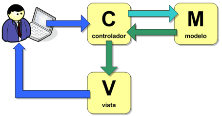

# MVC

MVC (Modelo-Vista-Controlador) es un patrón de diseño creado para gestionar interfaces de usario, datos y lógica de negocio. Su principal característica es la de separar la lógica de negocios y su visualzación.

- **Modelo:** Maneja datos y logica de negocios.
- **Vista:** Se encarga del diseño y presentación.
- **Controlador:** Enruta comandos a los modelos y vistas.

A continuación un ejemplo muy basico de como se puede aplicar el patron **MVC**:

## Modelo

Se crea la interface con las propiedades y sus definiciones de tipo.
Se crea la clase TodoModel con los metodos para agregar nueva tarea, y obtener todas las tareas.

Aqui es donde se implementa toda la lógica de negocio que es la que gestiona todo lo relacionado con el manejo de datos y las operaciones que no estan relacionadas con la interfaz de usuario.

- El modelo es el responsable de notificar a las vista cualquier cambio sobre los datos.  
  Como se puede ver, la lógica de negocio esta encapsulada en el modelo siguiendo los principios del patrón MVC.

```typescript
// TodoModel.ts

export interface Todo {
  id: number;
  text: string;
}

export class TodoModel {
  private todos: Todo[] = [];

  addTodo(todoText: string): void {
    const newTodo: Todo = {
      id: this.todos.length + 1,
      text: todoText,
    };

    this.todos.push(newTodo);
  }

  getTodoById(id: number): Todo | undefined {
    return this.todos.find((todo) => todo.id === id);
  }

  getAllTodos(): Todo[] {
    return this.todos;
  }
}
```

## Vista

En el siguiente ejemplo, en la vista se importa la interfaz para definir el tipo de dato que se le va a pasar al metodo displayTodoList que en este caso devolvera un mensaje por consola de cada tarea.

- La vista recibe las actualizaciones desde el modelo y se encarga de mostrarlos en la interfaz de usuario.

```typescript
// TodoView.ts

import { Todo } from './TodoModel';

export class TodoView {
  displayTodoList(todos: Todo[]): void {
    todos.forEach((todo) => console.log(`ID: ${todo.id}, Text: ${todo.text}`));
  }
}
```

## Controlador

En el controlador se importan las clases del modelo y de la vista, se crea una clase para el controlador que será el encargado de comunicar el modelo y la vista.  
Se incluye metodo para agregar tarea nueva y obtener todo el arreglo de tareas  
El metodo addTodo llama al metodo de la clase model **(Modelo)** tambien llamado addTodo que este agrega a la lista de tareas la nueva tarea.  
El metodo getTodoList llama guarda en la constante todos lo que retorna el metodo getAllTodos de la clase view **(Vista)**.

- El controlador es el encargado de recibir las interacciones del usuario y actualizar el modelo según estas interacciones.

```typescript
// TodoController.ts

import { TodoModel } from './TodoModel';
import { TodoView } from './TodoView';

export class TodoController {
  private model: TodoModel;
  private view: TodoView;

  constructor(model: TodoModel, view: TodoView) {
    this.model = model;
    this.view = view;
  }

  addTodo(todoText: string): void {
    this.model.addTodo(todoText);
  }

  getTodoList(): void {
    const todos = this.model.getAllTodos();
    this.view.displayTodoList(todos);
  }
}
```

## Uso

Un uso básico de este ejemplo seria el siguiente:
Una vez importado el modelo vista y controlador **MVC** se crean las instancias del modelo, la vista y el controlador pasandole (al controlador) como argumento la instancia del modelo y de la vista para que funcionen todos los metodos que hay dentro del controlador.

El flujo de MVC seria el siguiente:

- El usuario interactua con la vista.
- La vista notifica al controlador.
- El controaldor actualiza el modelo.
- El modelo notifica a la vista.
- La vista actualiza la interfaz de usuario.

```typescript
// app.ts

import { TodoModel } from './TodoModel';
import { TodoView } from './TodoView';
import { TodoController } from './TodoController';

// Crear instancias
const todoModel = new TodoModel();
const todoView = new TodoView();
const todoController = new TodoController(todoModel, todoView);

// Agregar tarea
todoController.addTodo('Aprender MVC');

// Mostrar tareas
todoController.getTodoList();
```
## Diagrama

<p align="center">
  
</p>
